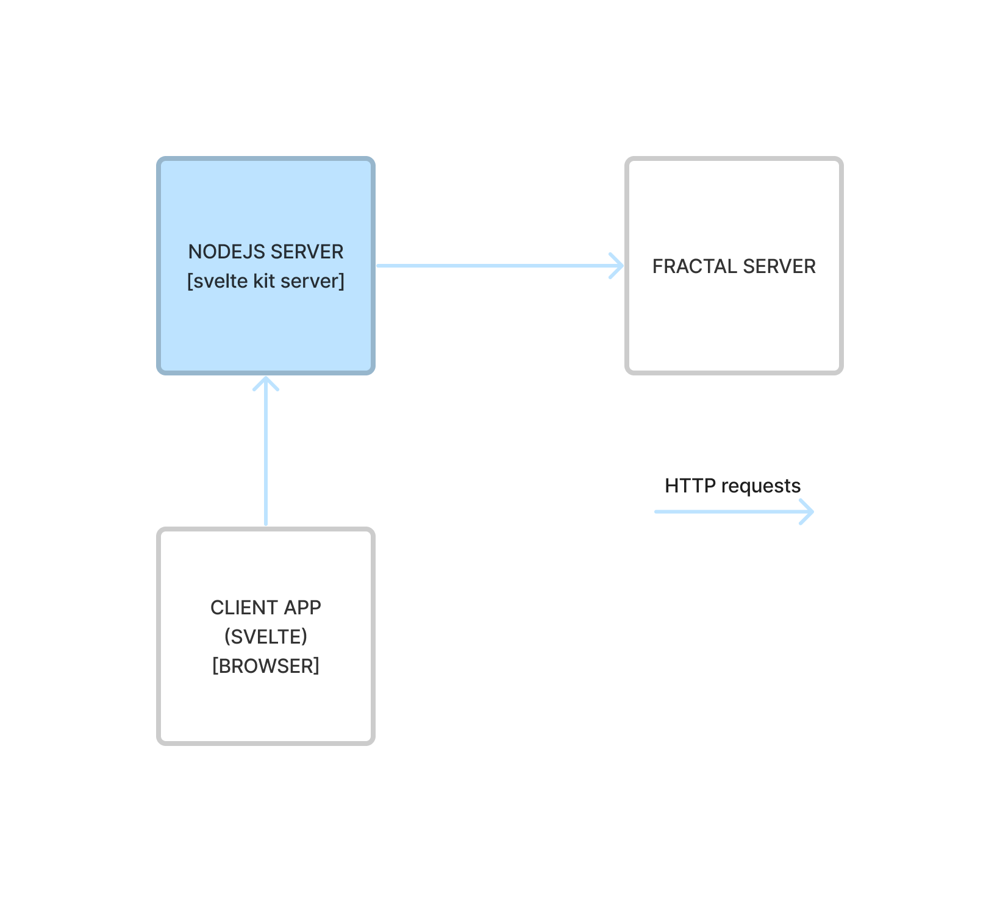

## Development setup

### Install node

Version 24 of Node.js is required. See the [quickstart](./quickstart.md) for more details about how to install node.

### Install fractal-web

Clone this repository

```bash
git clone https://github.com/fractal-analytics-platform/fractal-web.git
cd fractal-web
```

then optionally checkout to a specific version tag

```
git checkout v0.6.0
```

and finally install via

```bash
cd components
npm install
cd ..
npm install
```

### Environment variables

To run `fractal-web` you have to configure some environment variables.
The [environment variables page](./environment-variables.md) contains the complete list of supported environment variables and their default values.
It also includes some troubleshooting infomation about errors related to environment variables misconfiguration.

When running the application from the git repository, environment variables are set either in `.env` or `.env.development` files, see [vite documentation](https://vitejs.dev/guide/env-and-mode.html#env-files) (briefly: `.env.development` is the relevant file when using `npm run dev` and `.env` is the relevant file when using `npm run preview`).
You can also add your customizations in a file named `.env.local` or `.env.development.local` to avoid writing on env files that are under version control.

### Run fractal-web

For development, run the client application via

```bash
npm run dev
```

The application will run at `http://localhost:5173`.

To test a production build, first execute

```bash
npm run build
```

And then

```bash
npm run preview
```

Also in this case the application runs at `http://localhost:5173`.

## Coding conventions

### fetch

Only explicitly specify options when they differ from defaults.

Examples:

```js
// ✅ Good
const response = await fetch('/api/admin/v2/resource');

// ❌ Bad
const response = await fetch('/api/admin/v2/resource', { method: 'GET' });
```

Add Content-Type headers only when there is a body.

Examples:

```js
// ✅ Good
const headers = new Headers();
headers.set('Content-Type', 'application/json');

const response = await fetch(`/api/v2/project`, {
	method: 'POST',
	headers,
	body: normalizePayload(payload)
});

// ❌ Bad
const response = await fetch(`/api/v2/project/${projectId}`, {
	method: 'DELETE',
	headers
});
```

## Code-base structure

This project is based on [svelte kit](https://kit.svelte.dev) and follows its conventions and structure.

### 1-level folders

By default, the main application folder is located at `/src`.
The structure of this folder is explained in depth
in [svelte kit docs](https://kit.svelte.dev/docs/project-structure#project-files)

`/static` is a folder related to static files that will be served by the client server.
More on this could be found in
the [svelte kit docs](https://kit.svelte.dev/docs/project-structure#project-files-static).

The `/lib` folder contains files and sources that enable correct instrumentation and testing of this client application.
Currently, within this folder are present files to support the project's unit tests arrangements and other
library files to populate local instances of the fractal server in order to test the client.

As for testing, currently, there are two folders `/__tests__` and `/tests`.
The former contains files of unit tests executed by `vitest` and the latest
is related to `playwright` testing.
This structure could be improved and organized differently by updating project configuration files,
specifically `vite.config.js` and `playwrght.config.js` which are located at project root.

`/examples` folder contains configuration guidance to set up local environments to test different
fractal server / fractal web interoperability architectures.

`/docs` folder is the root of the project docs files.

```
[project root]
├ /src
├ /static
├ /lib
├ /__tests__
├ /tests
├ /examples
├ /docs
```

### Application structure

With reference to `/src/routes` folder, therein are defined svelte kit page components
that structure the fractal web client.

> It is important to mention that, this client application
> is [server-side rendered](https://kit.svelte.dev/docs/glossary#ssr).
> By default, this is the default behaviour
> of [svelte kit](https://kit.svelte.dev/docs/introduction#sveltekit-vs-svelte).

> Before proceeding, it is important to understand the distinction of files terminating with the suffix `+[.]server.js`.
> Those files are explicitly processed by the client's server.

This client application is in essence a proxy that enables users to interact with a server application, the fractal
server.
Through the browser interface, the svelte application enable users to build HTTP requests that will be sent to the
fractal server.

The svelte client and fractal server interact through a REST interface.

But how is this interaction implemented in this client?

### Client server interoperability

As said, the svelte client communicates with the fractal server through a set of REST APIs.

In this client, every request to the fractal server is sent by the _nodejs server that is serving the svelte
application_.

> It is important to understand that these requests are made in the server context of the svelte client.
> No request to the fractal server is sent directly by the browser of the user.

The fact that every request on behalf of a user is sent through a common backend nodejs server, implies a proxy
architecture.
The way this works is the following: the svelte client in the browser sends a HTTP request to the nodejs server that
is serving the application. This request, with the attached cookies, is then used to compose a new request to be sent to the fractal server.

> Note that the authentication context is kept thanks to cookies that establish user sessions.

The following image provides an overview for the reader of the described architecture.



To avoid duplicating the logic of each fractal-server endpoint and simplify the error handling, a special Svelte route has been setup to act like a transparent proxy: `src/routes/api/[...path]/+server.js`. This is one of the suggested way to handle a different backend [according to Svelte Kit FAQ](https://kit.svelte.dev/docs/faq#how-do-i-use-x-with-sveltekit-how-do-i-use-a-different-backend-api-server).

So, by default, the AJAX calls performed by the front-end have the same path and payload of the fractal-server API, but are sent to the Node.js Svelte back-end. Some Python API endpoints (like the `/auth` and `/admin` endpoints) that don't start with `/api` are handled in a slightly different way. Indeed, the `/api` prefix is needed by `hooks.server.js` to detect if the received call is an AJAX call, in order to process the token expiration in a custom way. To preserve this behavior for all the API calls these paths are rewritten adding the `/api` prefix.

Summarizing, the frontend code:

- uses exactly the same path of the fractal-server API for the `/api` endpoints
- uses `/api/auth` for `/auth` endpoints
- uses `/api/admin` for `/admin` endpoints

Other than the AJAX calls, there are also some calls to fractal-server API done by Svelte SSR, while generating the HTML page. These requests are defined in files under `src/lib/server/api/v1`. Here requests are grouped by contexts as `auth_api`, `admin_api`, [...].

### An example using actions

The login is still using the Svelte action approach, in which we have to extract the data from a formData object and then use it to build a JSON payload to be forwarded to fractal-server.

Consider the code at `src/lib/server/api/auth_api.js:5`:

```javascript
/**
 * Request to authenticate user
 * @param fetch
 * @param data
 * @returns {Promise<*>}
 */
export async function userAuthentication(fetch, data) {
	const response = await fetch(FRACTAL_SERVER_HOST + '/auth/token/login', {
		method: 'POST',
		body: data
	});

	if (!response.ok) {
		throw new Error('Authentication failed');
	}

	return await response.json();
}
```

This code is responsible to call the `/auth/token/login` REST api endpoint of the fractal server.
The request is made by the svelte client application in a backend context within the nodejs server.

The client will, if the request succeeds, handle the fractal server response in
a [form action](https://kit.svelte.dev/docs/form-actions).

```javascript
// src/routes/auth/login/+page.server.js

export const actions = {
	// Default page action / Handles POST requests
	default: async ({ request, cookies, fetch }) => {
		// TODO: Handle login request
		console.log('Login action');

		// Get form data
		const formData = await request.formData();
		// Set auth data
		let authData;
		try {
			authData = await userAuthentication(fetch, formData);
		} catch (error) {
			console.error(error);
			return fail(400, { invalidMessage: 'Invalid credentials', invalid: true });
		}
		const authToken = authData.access_token;
		// Decode JWT token claims
		const tokenClaims = jose.decodeJwt(authToken);

		// Set the authentication cookie
		const cookieOptions = {
			domain: `${AUTH_COOKIE_DOMAIN}`,
			path: `${AUTH_COOKIE_PATH}`,
			expires: new Date(tokenClaims.exp * 1000),
			sameSite: `${AUTH_COOKIE_SAME_SITE}`,
			secure: `${AUTH_COOKIE_SECURE}` === 'true',
			httpOnly: `${AUTH_COOKIE_HTTP_ONLY}` === 'true'
		};
		console.log(cookieOptions);
		cookies.set(AUTH_COOKIE_NAME, authData.access_token, cookieOptions);

		redirect(302, '/');
	}
};
```

The previous code is executed in the backend (as one could understand by the name of the file) and it basically provides
a form action that allows a user to login.

This kind of pattern, form actions, is widely used within the client application, as it enables the browser-side client
application to request different actions the server-side should take.

In this case, we briefly described the authentication flow of the svelte client application.

> Notice that the authentication and session of a user is managed through cookies. The client application requests a
> authentication token to the fractal server, which data is used to create another cookie that the nodejs server of the
> client application sends to the browser.

The default action within the `+page.server.js` is requested through an HTTP request that the browser-side client app
makes when a user sends an HTML from, for completion, the one defined in:

```html
<!-- src/routes/auth/login/+page.svelte -->

<script>
	export let form;
	let loginError = false;

	if (form?.invalid) {
		loginError = true;
	}
</script>

<div class="container">
	<div class="row">
		<h1>Login</h1>
	</div>
	<div class="row">
		<div class="col-md-4">
			<form method="POST">
				<div class="mb-3">
					<label for="userEmail" class="form-label">Email address</label>
					<input
						name="username"
						type="email"
						class="form-control {loginError ? 'is-invalid' : ''}"
						id="userEmail"
						aria-describedby="emailHelp"
						required
					/>
					<div id="emailHelp" class="form-text">The email you provided to the IT manager</div>
					<div class="invalid-feedback">{form?.invalidMessage}</div>
				</div>
				<div class="mb-3">
					<label for="userPassword" class="form-label">Password</label>
					<input name="password" type="password" class="form-control" id="userPassword" required />
				</div>
				<button class="btn btn-primary">Submit</button>
			</form>
		</div>
	</div>
</div>
```

### Application library

While the `src/routes` is the public-facing side of the client application, `src/lib` contains the client internals.

Within the lib are present four main sections: `common`, `components`, `server` and `stores`.

_Common_ contains client modules that export shared functionalities for both browser and server side parts of the
app.

_Components_ contains all the svelte components definitions that are used within the client app.
Components are organized by resources defined and managed by the fractal server.

_Server_ this is a special section as it is never shared and bundled into the package that a user receives in the
browser.
More info about this could be found in the svelte kit doc
about [server-only modules](https://kit.svelte.dev/docs/server-only-modules)

_Stores_ are modules that export svelte store objects that are used by components to manage the state of the
application.

> Note that stores are currently not well-organized or used due to the youth of the client.

## Error handling

Here we describe which coding patterns are used by fractal-web to handle various error cases.

### Fractal-server errors structure

Fractal-server error responses payloads are usually JSON structures having the error under a `detail` key. This is not true for the 500 Internal Server Error, which doesn't provide a JSON payload.

Generic fractal-server errors contain the error message string directly as `detail` value or as an array of values:

```json
{ "detail": "this is the error message" }
```

```json
{ "detail": ["this is also an error"] }
```

Validation errors associated with a specific request field are represented using a `loc` array that describes the position of the invalid field in the request payload:

```json
{
	"detail": [
		{
			"loc": ["body", "zarr_url"],
			"msg": "URLs must begin with '/' or 's3'.",
			"type": "value_error"
		}
	]
}
```

Some validation errors may not be associated with a specific field and in that case their `loc` array will reference a `__root__` element:

```json
{
	"detail": [
		{
			"loc": ["body", "__root__"],
			"msg": "error message",
			"type": "value_error"
		}
	]
}
```

The goal of fractal-web is to extract the error message and display it inside an alert component or directly near the invalid form field, when possible. If an unexpected JSON structure is received, fractal-web will display the error JSON payload as it is, but that should happen rarely, except for the JSON Schema form, whose errors may result in some complex payloads.

### Error responses in Svelte backend (SSR)

Files in `src/lib/server/api` provide API calls to fractal-server to be used from Svelte backend. These calls are usually required to be successful in order to properly display the page, since they retrieve the main resources of the page. A failure at this level is usually a 404 error (e.g. attempting to open a project with a non existent id) or something really severe (500 errors). For this reason the API calls errors happening on Svelte backend should usually be directly propagated, in order to display the error code inside the page.

The utility function `responseError()` (in `error.js`) can be used to propagate the error in these cases. It will throw an exception if an error response is detected, automatically extracting the `detail`.

It is suggested to handle the unsuccessful response first, in order to return the payload at the end of the function.

```javascript
if (!response.ok) {
	await responseError(response);
}
return await response.json();
```

In this way it is easier to define properly the type of the response using JSDoc annotation.

### Error responses in Svelte frontend

#### The AlertError class

The `AlertError` class represents errors handled by fractal-web that has to be displayed somewhere. It has a constructor that receives an object or string representing the error and an optional status code (if the error was originated from an unsuccessful API call).

It can be used to istantiate a new error message; this is mostly used when we need to propagate an error from a component to another, that will catch the error:

```javascript
throw new AlertError('Invalid JSON schema');
```

Most of the time it is used to handle an unsuccessful API response; the status code is used to check if it is a validation error (status is equals to 422) and it automatically extracts the message from the detail:

```javascript
throw await getAlertErrorFromResponse(response);
```

#### The standard error alert

It is possible to use the `displayStandardErrorAlert()` function to display a generic error inside an Bootstrap alert component. The function returns a reference to a `StandardErrorAlert` component, that can be used to hide the error invoking its `hide()` function.

Inside the page we have to add a div for the alert component, with a defined id:

```html
<div id="errorAlert-projectInfoModal" />
```

Then we have to define a variable for the alert component:

```javascript
/** @type {import('$lib/components/common/StandardErrorAlert.svelte').default|undefined} */
let errorAlert = undefined;
```

Finally, we invoke the function to display the error:

```javascript
errorAlert = displayStandardErrorAlert(
	new AlertError(result, response.status),
	'errorAlert-projectInfoModal'
);
```

If we need to hide the error (for example before clicking a submit button again), we can invoke the `hide()` function.

```javascript
errorAlert?.hide();
```

Notice that we are using the optional chaining operator (`?.`), since the variable might be undefined if no error happened previously.

#### Form validation errors

A form usually needs an error alert component to display generic errors and a mechanism to display errors associated with specific form fields. This logic has been incapsulated in the `FormErrorHandler` class.

The constructor accepts as first argument the id of the div that will contain the generic error message and as second argument an array containing all the fields that correspond with some input fields in the form.

```javascript
const formErrorHandler = new FormErrorHandler('taskCollectionError', [
	'package',
	'package_version',
	'package_extras',
	'python_version'
]);
```

Once created, it is possible to retrieve the `validationErrors` object from the form error handler:

```javascript
const validationErrors = formErrorHandler.getValidationErrorStore();
```

This is a Svelte store referencing a map of errors, so it has to be accessed prepending the `$` symbol: `$validationErrors`, as shown in the example above.

The Bootstrap validation classes are used inside the form: `has-validation` on parent, `is-invalid` on the invalid field and `invalid-feedback` for the message.

```svelte
<div class="input-group has-validation">
	<div class="input-group-text">
		<label class="font-monospace" for="package">Package</label>
	</div>
	<input
		name="package"
		id="package"
		type="text"
		class="form-control"
		required
		class:is-invalid={$validationErrors['package']}
		bind:value={python_package}
	/>
	<span class="invalid-feedback">{$validationErrors['package']}</span>
</div>
```

The `handleErrorResponse()` function is used to populate the fields from an error response:

```javascript
if (!response.ok) {
	await formErrorHandler.handleErrorResponse(response);
}
```

The class also provides a `clearErrors()` function and some functions to manually add or remove errors (`addValidationError()`, `removeValidationError()`, `setGenericError()`); these are useful to handle some validation directly on the frontend (e.g. required fields), without performing any API calls.

## JSON Schema form module

The `components` folder on this repository contains a Svelte project that provides the JSON Schema form component (`JSchema.svelte`) and its related functions and classes. The file `index.js` contains the list of components and functions that are exported for public usage, so that they can be included using `from 'fractal-components'` from the main project.

The main project defines `fractal-components` in `vite.config.js`, as an alias pointing to `components/src/lib/index.js`. In this way the components module is automatically built when the main project is built and the Hot Module Reload feature still works.

Moreover, the path to components module has been added as `server.fs.allow` Vite config option, to prevent the following error while serving the files using `npm run dev`:

```
The request url "/path/to/fractal-web/components/src/lib/index.js" is outside of Vite serving allow list.
```

> **Important**: When importing js files inside the `components` module it is necessary to use a relative path. The editor might autocomplete the imports using the `$lib` prefix, but that will not work when the module is included in the main application, since it redefines the `$lib` path again.

### Structure of the code

The `JSchema` Svelte component intializes a class named `FormManager`, that handles the following features:

- creates and stores an object (`root`) used to draw the form;
- provides the functions to create new form elements;
- attaches a `notifyChange()` function to each created form element; this function is used by each component to notify changes to the manager (e.g. the value of an input changes, a new element is added to an array, and so on), then the function dispatches a `change` event up to the `JSchema` component;
- wraps the `SchemaValidator` and provides a `validate()` function;
- provides a `getFormData()` function, that returns an object based on the data present in the form.

The creation of the `root` object requires 2 preliminary steps, that are useful to reduce the complexity of the subsequent object creation:

1. provided JSON Schema is adapted, to create a simpler but equivalent JSON Schema (`jschema_adapter.js`);
2. an object representing the initial form data is created, considering both the provided data (if any) and the default values (`jschema_initial_data.js`).

The `adaptJsonSchema()` function does the following:

1. removes the properties to ignore (e.g. `zarr_url`, `zarr_urls`, `init_args`, `zarr_dir`);
2. resolves and replaces the schema references (`$ref` fields pointing to definitions);
3. merges the `allOf` items.

The `getJsonSchemaData()` function initializes an object representing the initial form data. If the `initialValue` parameter is not set the created object is populated using the default values. If an `initialValue` object is provided, the function adds to it all the optional fields set to null (this is needed to have an object that acts as a complete skeleton for the form).

Using the adapted JSON Schema and the computed data object, the `FormManager` populates the `root` object, initializing a dedicated class for each form element (`NumberFormElement`, `ArrayFormElement`, `BooleanFormElement`, ...). These classes contain fields that are specific to each form element type and may contain additional functions to manipulate them (e.g. `addChild`, `removeChild`). Functions that add new children delegate the creation to the `FormManager`, since it is the class having the knowledge to create form elements of any type, and then add the new child to an internal array of children.

Each form element is mapped to a dedicated Svelte component (e.g. the `NumberFormElement` class is passed to a `NumberProperty.svelte` component). Each property component can contain additional functions for validating the input values and display the validation errors, but delegates to the wrapped form element class any additional logic.

This structure attempts to achieve a greater separation of concerns, needed to handle properly such a complex component.

## Testing

### Unit tests

Unit tests are performed via [vitest](https://vitest.dev), via the `test` script defined in `package.json`.

### End-to-end tests

E2E tests are done using [Playwright](https://playwright.dev/).

The first time, or at Playwright upgrades, the following command can be used to install Playwright browsers and system dependencies:

```bash
npx playwright install --with-deps
```

Tests configuration is defined in the file `playwright.config.js`.

Usually you would like to run the tests with your currently running instances of fractal-server and fractal-web. By default, if port 8000 and port 5173 are active, Playwright will use the servers that are already running. Otherwise, Playwright will execute the script `tests/start-test-server.sh` to start fractal-server and npm commands to build and start the frontend server. Notice that the `start-test-server.sh` is designed for the CI environment and is not intended for developers who want to run tests locally.

To execute all the tests run the following command:

```bash
npx playwright test
```

To tests using only one of the supported browsers use the `--project` flag. Usually the tests run faster on Chromium:

```bash
npx playwright test --project=chromium
```

Two tests requires a special setup and can be ignored with specific environment variables:

1. `pixi.setup.js`, requires pixi to be installed and configured; use `SKIP_PIXI_TEST=true` to skip this test;
2. `oauth2.spec.js`, requires the IdP container; use `SKIP_OAUTH_TEST=true` to skip this test;

To execute a single test use:

```bash
npx playwright test tests/path/to/test.spec.js --project=chromium
```

Notice that if the test depends on other tests, they will be executed too. Some tests are a basic dependency of all the other tests (like `auth.setup.ts`).

To execute the tests seeing the browser add the `--headed` flag or the `--debug` flag if you need to watch them step by step.

To print Svelte webserver log set the environment variable `DEBUG=pw:webserver`.

### Run the OAuth2 login test

OAuth2 test requires a running instance of `dexidp` test image and a fractal-server instance configured to use it.

Use the following command to start the test IdP container:

```sh
docker run -d --rm -p 5556:5556 ghcr.io/fractal-analytics-platform/oauth:0.1
```

Set the following configuration to `.fractal_server.env`:

```
OAUTH_CLIENT_NAME=dexidp
OAUTH_CLIENT_ID=client_test_web_id
OAUTH_CLIENT_SECRET=client_test_web_secret
OAUTH_REDIRECT_URL=http://localhost:5173/auth/login/oauth2/
OAUTH_OIDC_CONFIG_ENDPOINT=http://127.0.0.1:5556/dex/.well-known/openid-configuration
```

### Local `fractal-server` instance

The `lib/fractal-server` folder includes basic instructions to get a local instance of `fractal-server` running.

## Documentation

Here are the instructions to serve the documentation on localhost:8001:

```bash
uv sync --frozen
uv run zensical serve --dev-addr localhost:8001
```

The documentation includes links to the sandbox pages.
These pages are built separately and added to the site folder by the CI before publishing the documentation, so these links will not work when using the `zensical` preview command displayed above.
If you want to preview the sandbox pages run `npm run dev` inside the sandbox folder.

## pre-commit setup

In your local folder, create a file `.git/hooks/pre-commit` with the following content

```bash
#!/bin/bash
npm run pre-commit
RESULT=$?
[ $RESULT -ne 0 ] && exit 1
exit 0
```

and make this file executable (`chmod +x .git/hooks/pre-commit`).

In this way, `npm run pre-commit` will run before every commit. This script is
defined in `package.json`, and points to
[`lint-staged`](https://github.com/okonet/lint-staged). The configuration is
written in `.lintstagedrc.json`, and it lists the checks to perform on each
kind of file (e.g. `eslint` and then `prettier`).

## Release

Steps to release a new `fractal-web` version:

- Update `CHANGELOG.md` on `main` branch, replacing the "Unreleased" temporary title with the desidered version number
- Update the `version-compatibility.md` doc page
- Commit the changes
- Execute `npm version <major|minor|patch>`
- Execute `git push origin main`
- Execute `git push origin <new-version-tag>`
- Update the GitHub release page with the information from `CHANGELOG.md`

> NOTE: Pushing a new version tag (like v5.6.7) triggers [a dedicated GitHub
> action](https://github.com/fractal-analytics-platform/fractal-web/blob/main/.github/workflows/github_release.yaml),
> which also creates build artifacts (based on `npm pack`) and attaches them to
> the GitHub release.
