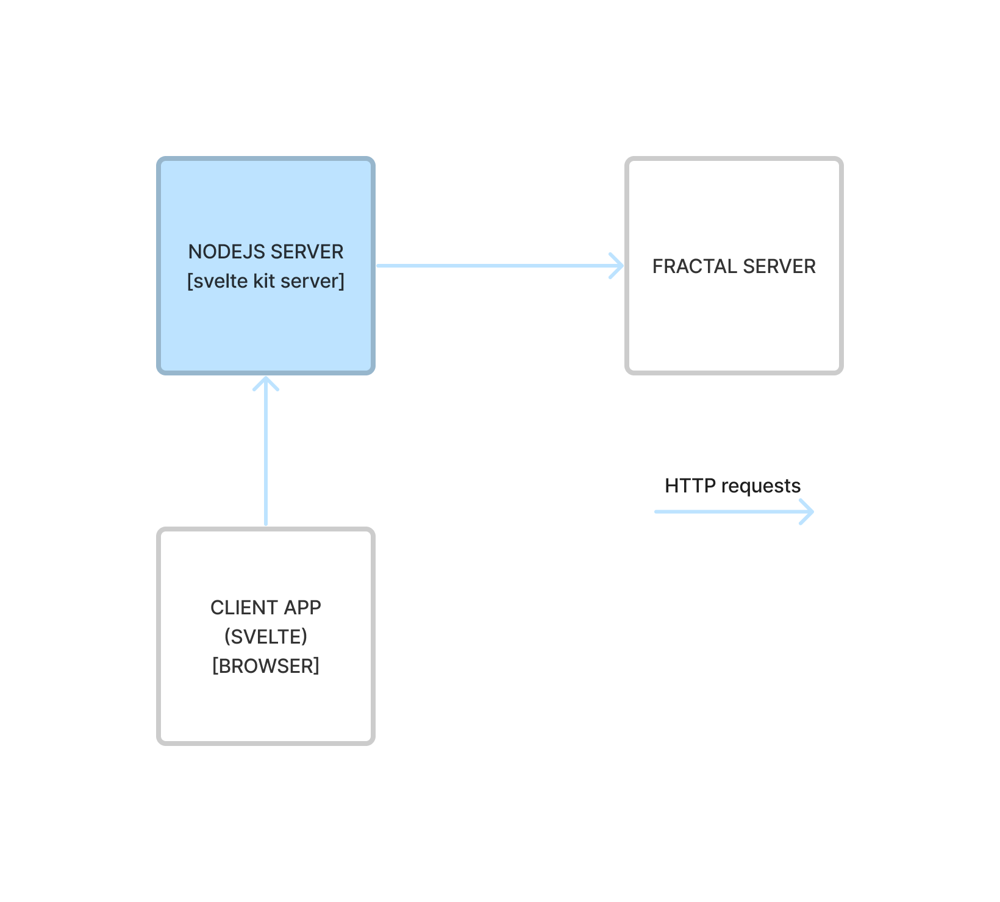

# Code-base structure

This project is based on [svelte kit](https://kit.svelte.dev) and follows its conventions and structure.

## 1-level folders

By default, the main application folder is located at `/src`.
The structure of this folder is explained in depth
in [svelte kit docs](https://kit.svelte.dev/docs/project-structure#project-files)

`/static` is a folder related to static files that will be served by the client server.
More on this could be found in
the [svelte kit docs](https://kit.svelte.dev/docs/project-structure#project-files-static).

The `/lib` folder contains files and sources that enable correct instrumentation and testing of this client application.
Currently, within this folder are present files to support the project's unit tests arrangements and other
library files to populate local instances of the fractal server in order to test the client.

As for testing, currently, there are two folders `/__tests__` and `/tests`.
The former contains files of unit tests executed by `vitest` and the latest
is related to `playwright` testing.
This structure could be improved and organized differently by updating project configuration files,
specifically `vite.config.js` and `playwrght.config.js` which are located at project root.

`/examples` folder contains configuration guidance to set up local environments to test different
fractal server / fractal web interoperability architectures.

`/docs` folder is the root of the project docs files.

```
[project root]
├ /src
├ /static
├ /lib
├ /__tests__
├ /tests
├ /examples
├ /docs
```

## Application structure

With reference to `/src/routes` folder, therein are defined svelte kit page components
that structure the fractal web client.

> It is important to mention that, this client application
> is [server-side rendered](https://kit.svelte.dev/docs/glossary#ssr).
> By default, this is the default behaviour
> of [svelte kit](https://kit.svelte.dev/docs/introduction#sveltekit-vs-svelte).

> Before proceeding, it is important to understand the distinction of files terminating with the suffix `+[.]server.js`.
> Those files are explicitly processed by the client's server.

This client application is in essence a proxy that enables users to interact with a server application, the fractal
server.
Through the browser interface, the svelte application enable users to build HTTP requests that will be sent to the
fractal server.

The svelte client and fractal server interact through a REST interface.

But how is this interaction implemented in this client?

### Client server interoperability

As said, the svelte client communicates with the fractal server through a set of REST APIs.

In this client, every request to the fractal server is sent by the *nodejs server that is serving the svelte
application*.

> It is important to understand that these requests are made in the server context of the svelte client.
> No request to the fractal server is sent directly by the browser of the user.

The fact that every request on behalf of a user is sent through a common backend nodejs server, implies a proxy
architecture.
The way this works is the following: the svelte client in the browser sends a HTTP request to the nodejs server that
is serving the application. This request, with the attached cookies, is then used to compose a new request to be sent to the fractal server.

> Note that the authentication context is kept thanks to cookies that establish user sessions.

The following image provides an overview for the reader of the described architecture.



To avoid duplicating the logic of each fractal-server endpoint and simplify the error handling, a special Svelte route has been setup to act like a transparent proxy: `src/routes/api/[...path]/+server.js`. This is one of the suggested way to handle a different backend [according to Svelte Kit FAQ](https://kit.svelte.dev/docs/faq#how-do-i-use-x-with-sveltekit-how-do-i-use-a-different-backend-api-server).

So, by default, the AJAX calls performed by the front-end have exactly the same path and payload of the fractal-server API, but are sent to the Node.js Svelte back-end.

Other than the AJAX calls, there are also some calls to fractal-server API done by Svelte SSR, while generating the HTML page. These requests are defined in files under `src/lib/server/api/v1`. Here requests are grouped by contexts as `auth_api`, `monitoring_api`, [...].

### An example using actions

The login is still using the Svelte action approach, in which we have to extract the data from a formData object and then use it to build a JSON payload to be forwarded to fractal-server.

Consider the code at `src/lib/server/api/v1/auth_api.js:5`:

```javascript
/**
 * Request to authenticate user
 * @param fetch
 * @param data
 * @returns {Promise<*>}
 */
export async function userAuthentication(fetch, data) {
	const response = await fetch(FRACTAL_SERVER_HOST + '/auth/token/login', {
		method: 'POST',
		credentials: 'include',
		mode: 'cors',
		body: data
	});

	if (!response.ok) {
		throw new Error('Authentication failed');
	}

	return await response.json();
}
```

This code is responsible to call the `/auth/token/login` REST api endpoint of the fractal server.
The request is made by the svelte client application in a backend context within the nodejs server.

The client will, if the request succeeds, handle the fractal server response in
a [form action](https://kit.svelte.dev/docs/form-actions).

```javascript 
// src/routes/auth/login/+page.server.js

export const actions = {
	// Default page action / Handles POST requests
	default: async ({ request, cookies, fetch }) => {
		// TODO: Handle login request
		console.log('Login action');

		// Get form data
		const formData = await request.formData();
		// Set auth data
		let authData;
		try {
			authData = await userAuthentication(fetch, formData);
		} catch (error) {
			console.error(error);
			return fail(400, { invalidMessage: 'Invalid credentials', invalid: true });
		}
		const authToken = authData.access_token;
		// Decode JWT token claims
		const tokenClaims = jose.decodeJwt(authToken);

		// Set the authentication cookie
		const cookieOptions = {
			domain: `${AUTH_COOKIE_DOMAIN}`,
			path: `${AUTH_COOKIE_PATH}`,
			expires: new Date(tokenClaims.exp * 1000),
			sameSite: `${AUTH_COOKIE_SAME_SITE}`,
			secure: `${AUTH_COOKIE_SECURE}` === 'true',
			httpOnly: `${AUTH_COOKIE_HTTP_ONLY}` === 'true'
		};
		console.log(cookieOptions);
		cookies.set(AUTH_COOKIE_NAME, authData.access_token, cookieOptions);

		throw redirect(302, '/');
	}
};
```

The previous code is executed in the backend (as one could understand by the name of the file) and it basically provides
a form action that allows a user to login.

This kind of pattern, form actions, is widely used within the client application, as it enables the browser-side client
application to request different actions the server-side should take.

In this case, we briefly described the authentication flow of the svelte client application.

> Notice that the authentication and session of a user is managed through cookies. The client application requests a
> authentication token to the fractal server, which data is used to create another cookie that the nodejs server of the
> client application sends to the browser.

The default action within the `+page.server.js` is requested through an HTTP request that the browser-side client app
makes when a user sends an HTML from, for completion, the one defined in:

```html
<!-- src/routes/auth/login/+page.svelte -->

<script>
  export let form;
  let loginError = false;

  if (form?.invalid) {
    loginError = true;
  }
</script>

<div class='container'>
  <div class='row'>
    <h1>Login</h1>
  </div>
  <div class='row'>
    <div class='col-md-4'>
      <form method='POST'>
        <div class='mb-3'>
          <label for='userEmail' class='form-label'>Email address</label>
          <input
            name='username'
            type='email'
            class="form-control {loginError ? 'is-invalid' : ''}"
            id='userEmail'
            aria-describedby='emailHelp'
            required
          />
          <div id='emailHelp' class='form-text'>The email you provided to the IT manager</div>
          <div class='invalid-feedback'>
            {form?.invalidMessage}
          </div>
        </div>
        <div class='mb-3'>
          <label for='userPassword' class='form-label'>Password</label>
          <input name='password' type='password' class='form-control' id='userPassword' required />
        </div>
        <button class='btn btn-primary'>Submit</button>
      </form>
    </div>
  </div>
</div>
```

## Application library

While the `src/routes` is the public-facing side of the client application, `src/lib` contains the client internals.

Within the lib are present four main sections: `common`, `components`, `server` and `stores`.

_Common_ contains client modules that export shared functionalities for both browser and server side parts of the
app.

_Components_ contains all the svelte components definitions that are used within the client app.
Components are organized by resources defined and managed by the fractal server.

_Server_ this is a special section as it is never shared and bundled into the package that a user receives in the
browser.
More info about this could be found in the svelte kit doc
about [server-only modules](https://kit.svelte.dev/docs/server-only-modules)

_Stores_ are modules that export svelte store objects that are used by components to manage the state of the
application.
> Note that stores are currently not well-organized or used due to the youth of the client.

## Error handling

The errors received from fractal-server are displayed in error modals without changing the content of their messages. The `displayStandardErrorAlert()` function can be used to easily display an error message alert in a div having a specific id. This function returns a `StandardErrorAlert` object that can be stored in a variable and then used to hide previous error messages calling its `hide()` method.

Here an example:

```javascript
async function myFunction() {
  // remove previous error
  if (errorAlert) {
    errorAlert.hide();
  }

  const response = await fetch(`/api/v1/something`);
  if (response.ok) {
    // do something with the result
  } else {
    const error = await response.json();
    // add error alert inside the element having 'errorElement' as id
    errorAlert = displayStandardErrorAlert(error, 'errorElement');
  }
}
```

When the displaying of the error alert should be handled by the caller function it is possible to throw an `AlertError` that has to be caught by the caller in order to display the message.

Errors happening during SSR should be considered fatal and propagated using the `responseError()` utility function:

```javascript
if (response.ok) {
  return await response.json();
}
await responseError(response);
```
