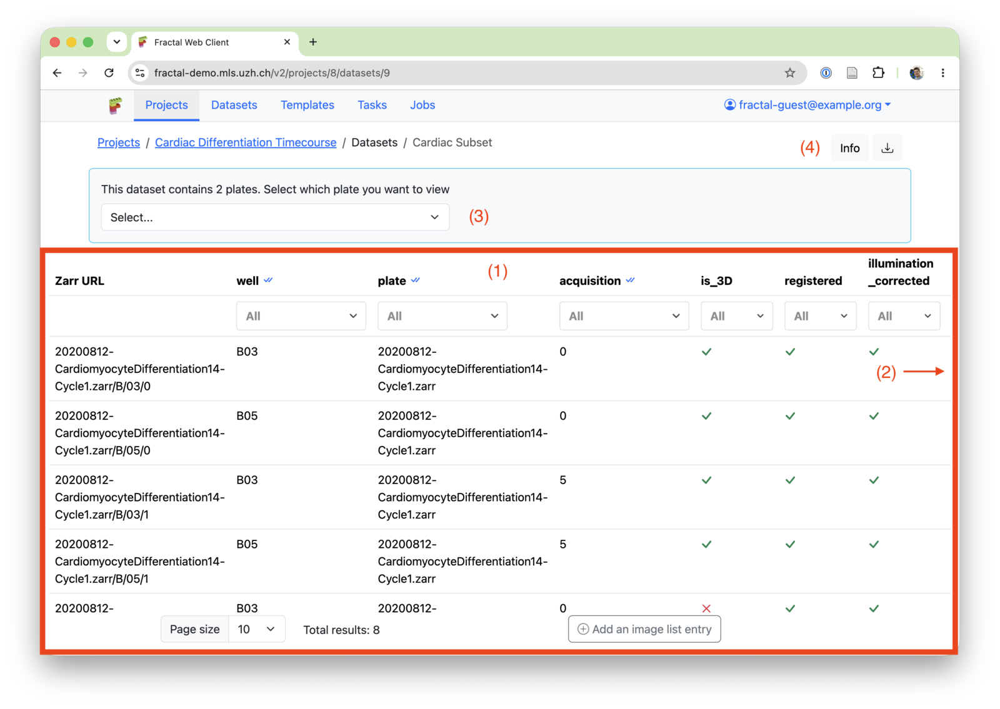
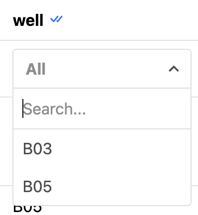

# Dataset page

!!! info "What is a dataset?"

    --8<-- "datasets.md"

    [Learn more about datasets →](../concepts/datasets.md)

## Overview

### 1. Image List

The dataset image list contains an overview of all the OME-Zarr images belonging to a given dataset. You can see the following parts:

- The Zarr URL: The ending of the zarr_url relative to the dataset zarr directory
- Attributes & Types: Metadata about each OME-Zarr image that helps you find the exact image you were looking for. [Learn more about attributes and types](../concepts/datasets.md#what-a-dataset-contains)
- Additional options (see 2. Image Options)

Typical actions include:

- Filter the image list using well & attribute filters. You can combine multiple filters to narrow down your selection.

- Manually add an image to the image list: Typically only done for debugging purposes. Use a converter or the "Import OME-Zarr" task instead as part of your workflows to populate your dataset.

### 2. Image Options

For each image, you can:

- Open the image in OME-Zarr viewers
- Get the full URL to the dataset for the [fractal data service](fractal_data.md)
- Manually edit an image list entries (only meant to be used for debugging)
- Delete a dataset entry: This does not delete the on-disk OME-Zarr, it just removes the reference to this OME-Zarr from the image list

### 3. HCS Plate options

If your dataset contains an OME-Zarr HCS plate, you can select a plate to open in a viewer, get the URL for or to open in the Fractal feature explorer.

### 4. Dataset info

The dataset info allows you to edit the name of your dataset and see the full Zarr directory where Fractal places all OME-Zarrs created in this dataset.
The dataset download provides you with a json version of your dataset. It contains the base dataset info and the full image list, but not the processing history. The serialised dataset can be downloaded for bulk edits and new datasets can be created based on this download.

## Related

- Concept: [Datasets](../concepts/datasets.md)
- Reference: [Workflow](workflow.md) · [Jobs](jobs.md)
